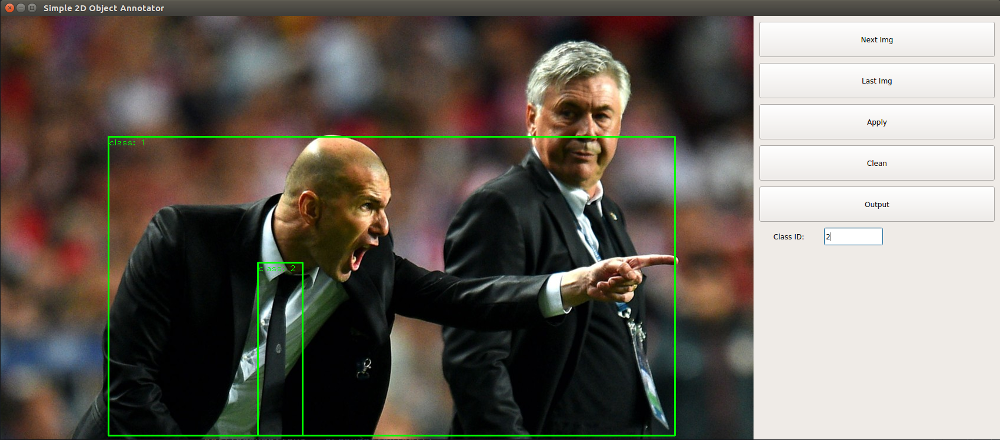

# 2D Object Annotator

This repo holds the code of a simple 2D object annotator for the object detection task, and the annotation structure is shown as follow:
```
{"img1.jpg":[{"bbox":[xmin,ymin,width,height],"class":id}],
"img2.jpg":[{"bbox":[xmin,ymin,width,height],"class":id}]}
```


## Dependencies

* Python >= 3.6
* PyQt5
* OpenCV

## Usage procedure

1. Users can put images into the **dataset/image** directory and run the script:

Single-class:
```
python annotator.py --mode single --scale 1.0 --img_dir dataset/image --label_file dataset/label/annotation.json
```
Multi-class:
```
python annotator.py --mode multi --scale 1.0 --img_dir dataset/image --label_file dataset/label/annotation.json
```
Users can also adjust the **scale** to change the window size.

2. As for multi-class mode, users can setup the object class_id (i.e. 1, 2, 3), and single-class mode has the default class_id 1:



3. Users can click the **"Apply"** to confirm the current result, and click the **"Clean"** to clean the current result or click the **"Output"** to write the current annotation result. The **"Next Img"** button and keyboard key **Down**, **"Last Img"** button and keyboard key **Up** can be used to select the image.
